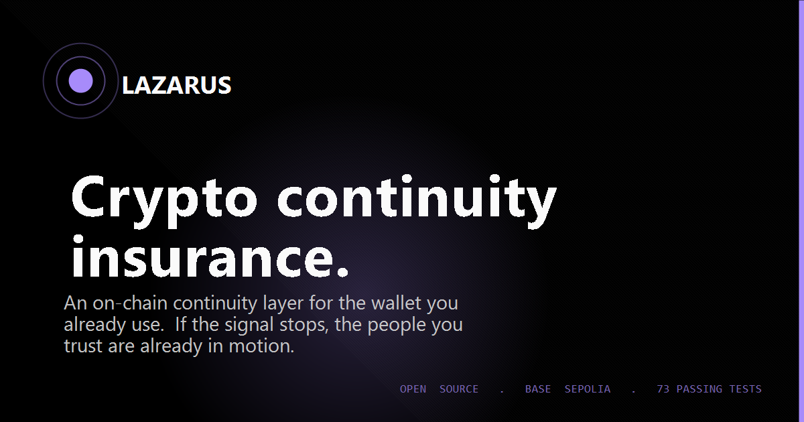

# Lazarus Protocol

**Crypto continuity insurance.** An on-chain monitoring + recovery layer for the wallets you already use. For everyone — not just founders, not just whales. Anyone whose family or community would be locked out of their assets if something happened to them.

> Your wallet goes silent. A network of people you trust verifies something is wrong. Pre-written instructions fire, emergency funds reach the right people, nothing of yours goes to zero. Normal transactions are never intercepted.



---

## Links

- 🎬 **90-second walkthrough:** open [`demo.html`](./demo.html) — self-running cinematic product demo with captions and animated UI, no install required. Use [`DEMO.md`](./DEMO.md) when you record the actual MP4 for submission.
- 🌐 **Live demo:** deploy in ~30 minutes via [`DEPLOYMENT.md`](./DEPLOYMENT.md) (Vercel + Base Sepolia). Until deployed, the dashboard runs in simulation mode using local seed data — every UI flow is exercisable, but on-chain reads are mocked.
- 📖 **Documentation:** [`docs.html`](./docs.html) — invariants, roles, petition lifecycle, security guarantees, contract reference
- 🛡️ **Threat model:** [`THREATS.md`](./THREATS.md) — STRIDE-style adversary catalogue mapped to contract code, including coercion / kidnap defense
- ⛽ **Gas benchmarks:** [`GAS.md`](./GAS.md) — measured gas usage for every user-facing operation
- 📄 **Contract on Basescan:** populated once `npm run deploy:sepolia` runs and the printed addresses are pasted into `js/contract.js` (instructions in `DEPLOYMENT.md` step 5)

---

## Why this matters

Every year, billions in crypto become unrecoverable — lost keys, forgotten passphrases, owners who die or disappear, families locked out of the assets their partner spent a lifetime building. The people most hurt are usually the ones who never bought any crypto themselves: the spouse who can't pay rent, the kids who can't access their college fund, the small business that can't make payroll.

Existing recovery solutions force you to either (a) hand over your seed to a third party, or (b) give up self-custody. Lazarus does neither. It's an **insurance layer on top of your existing wallet** — it reads public on-chain activity as a heartbeat, and orchestrates escalation only when your wallet goes genuinely silent.

## The four invariants

These are enforced at the contract level, not in a terms-of-service document:

1. **Normal transactions are never intercepted.** Lazarus only reads public on-chain data. Your wallet is untouched.
2. **Confirmers earn nothing from petitions they vote on.** Enforced in `executePetition()` via `confirmerVotedOnPetition[id][addr]`. Anti-fraud by construction.
3. **Time alone never triggers a release.** `protectionScore()` floors at 40 from time alone — and even hitting that floor releases nothing. A Custodian must file a petition, Confirmers must vote, a challenge window must pass.
4. **The owner can always resurrect.** A single `recordActivity()` call cancels every open petition and restores the score.

## Architecture at a glance

| Layer | Tech | Notes |
|-------|------|-------|
| Contracts | Solidity 0.8.19 | `LazarusProtocol` (~1,070 lines), `LazarusVault` (yield tier), `LazarusRegistry` (handles). 90 passing tests across the three. No external deps beyond an optional Chainlink price feed. |
| Chains | Base, Optimism, Arbitrum, Ethereum (all sepolia + mainnet where deployed) | Chain-agnostic — frontend picks the network that matches your wallet |
| Frontend | Vanilla HTML/CSS/JS, ethers v6 | No build step. Open `index.html` in a browser. |
| Indexer (planned) | Off-chain service reading wallet activity → `recordActivity()` | Hackathon uses demo button + manual heartbeats |
| Content | IPFS for instruction blobs | Hash anchored on-chain |

### Roles

- **Confirmer** — verifies a petition is legitimate via blind commit-reveal voting. Excluded from receiving funds on any petition they voted on (`confirmerVotedOnPetition[id][addr]`).
- **Custodian** — can file petitions and receive funds. Cannot vote.
- **Watcher** — neutral observer with veto power. Two Watcher vetoes halt any petition permanently. Two Watchers must also co-sign to clear a duress flag or to allow the owner to cancel under duress.

A single address holds at most one role at a time — `_applyRole` reverts if you try to grant a second role on top of an active one without revoking first. Combined with `confirmerVotedOnPetition`, this is what enforces the "voters cannot earn from what they voted on" invariant.

### Petition lifecycle

```
File → Commit (sealed hashes) → Reveal → Challenge window → Execute / Veto / Cancel
```

Each phase has a deadline. The 72-hour challenge window gives the owner a chance to resurrect before funds move. 0.2% release fee goes to the Lazarus Pool.

## Run locally

```bash
npm install
npx hardhat test                 # 90 tests, all passing

# 1) Fund deployer wallet at https://www.coinbase.com/faucets/base-ethereum-sepolia-faucet
# 2) Set LAZARUS_POOL in .env (any address you control on Base Sepolia)
npm run deploy:sepolia           # prints the deployed address

# 3) Paste the printed address into js/contract.js line 19:
#    address: '0xYourDeployedAddress'

# 4) Open the app — everything is local HTML, no build step
start index.html                 # Windows
open index.html                  # macOS
```

Then, in the app:
- Connect MetaMask (auto-switches to Base Sepolia)
- The topbar shows `LIVE · ON-CHAIN`
- Record a heartbeat, file a test petition, commit/reveal votes — every action is a signed tx visible on Basescan

## What's in the repo

```
contracts/Lazarus.sol         Main protocol (1,050 lines)
contracts/LazarusVault.sol    Opt-in yield tier (15% of yield only, never principal)
contracts/LazarusRegistry.sol Singleton handle registry (one @name per wallet)
test/                         90 passing tests across the three contracts
scripts/deploy.js             Hardhat deploy script
hardhat.config.js             Base Sepolia + mainnet config

index.html                  Marketing landing page
app.html                    Dashboard app
css/                        Split stylesheets (tokens, base, components, marketing, app)
js/
  contract.js               ethers v6 wiring (reads, writes, ENS, commit-reveal helpers)
  app.js                    Dashboard logic + 7-step onboarding
  marketing.js              Landing page interactions
  hero3d.js                 Three.js hero canvas
  trailer.js                Cinematic trailer modal

tools/og-maker.html         One-click generator for og.png (see below)
```

## Generating the OG social preview image

`og.png` is referenced by Open Graph meta tags. To generate it:

1. Open `tools/og-maker.html` in any browser.
2. Click **Download og.png**.
3. Save the file to the repo root (next to `index.html`).

## Security highlights

- **Single-active-role invariant.** `_applyRole` reverts on any second-role grant unless the previous role is revoked first. Combined with per-petition `confirmerVotedOnPetition[id][addr]` checks in `executePetition()`, voters can never receive funds from petitions they touched.
- **Blind commit-reveal voting.** Confirmers submit a sealed `keccak256(approve, salt)` during the commit window. Reveals happen later. Vote tallies are unobservable until the reveal window closes — so a vote-buying attacker can't pay for an outcome they can verify.
- **Duress protocol.** `recordActivityUnderDuress(salt)` emits an `ActivityRecorded` event identical to a normal heartbeat (so the coercer relaxes), plus a `DuressSignaled` flag that gates owner-alone cancellations. Past the commit phase — or any time duress is active — the owner needs 2 Watcher co-signatures to cancel a petition.
- **Reentrancy guard** on `executePetition()` and `withdraw()`.
- **Spending caps** — 15% (general) / 40% (medical) / 35% (legal) / 30% (dependent) per petition type, plus a 25% rolling 90-day aggregate cap. Aggregate iteration is bounded by a head-pointer pruned on every execute, so storage growth doesn't drift toward DoS.
- **Death fee cap** at $2,500 via Chainlink oracle, with `latestRoundData()` staleness check (`updatedAt` within 1 day) and a flat-fee fallback when the feed is unhealthy.
- **Two-step ownership transfer** (`initiateOwnershipTransfer` → `acceptOwnership`).
- **No-Release Freeze** — one-way switch that permanently disables all Custodian releases. For owners who want the monitoring without the recovery path. Cannot be engaged while any petition is open (now an O(1) counter check, not a sweep).

## Economics

Monitoring is free, forever. The only fee a user pays is on a release event itself (0.20–0.40%, capped at $2,500 for the death-confirmed path), and only if the protocol actually protects them. The protocol funds itself through structurally separate revenue lines that don't touch user wallets — none of which a user ever feels in normal use. See `docs.html` for the user-facing breakdown.

## What's NOT in this submission (honesty section)

The product is designed as a continuity layer that runs on autopilot. This hackathon build does not yet include several pieces that production needs:

- **Off-chain indexer.** The contract exposes `recordActivity()` for an authorized relayer to call when it observes outgoing on-chain activity from the protected wallet. That relayer service is not built. For demo purposes, the wallet activity panel reads recent outgoing txs from the block explorer and the owner records heartbeats by signing `recordActivity()` directly, or via the dashboard "Record activity" button.
- **Mobile companion.** Referenced in the SOL system prompt as a future heartbeat source. Not implemented.
- **Audit.** No formal audit. Tests cover invariants and the duress protocol; that is not a substitute. Treat balances on a deployed contract as testnet-only.
- **Live yield strategy.** `LazarusVault.distributeYield` is permissionless on purpose — a v0 hook for simulating yield events. Production wires this to an audited strategy (Aave/Lido) via `setStrategy`. Not done here.
- **Real chain liveness.** Without `npm run deploy:sepolia` and pasting the printed addresses into `js/contract.js`, the dashboard runs on local seed data. Every action signs against simulated state, not on-chain calls. Deploy steps are in `DEPLOYMENT.md`.

## Roadmap

Hackathon-stage. Indexer, audit, mobile companion, and broader integrations are next. Specifics will be announced as each milestone lands.

## License

MIT — see [LICENSE](./LICENSE) if included, otherwise inherited from contract SPDX header.
